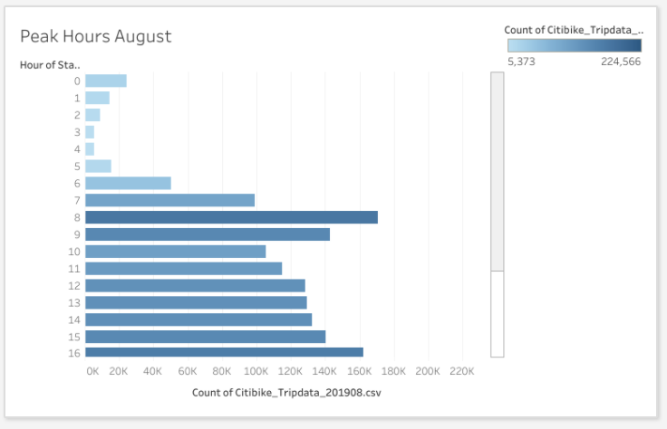

# Tableau – Data Visualization

## Overview of Project
The purpose of this project is to visualize and analyze data from Citibike Program in New York City.

The following tasks to complete:
* Show the length of time that bikes are checked out for all riders and genders.
* Show the number of bike trips for all riders and genders for each hour of each day of the week.
* Show the number of bike trips for each type of user and gender for each day of the week.

## Resources:
* Data sources: 201908-citibike-tripdata.csv and Citibike_Tripdata_201908.csv

## Tools
1. Python (Data Collection):
  * Pandas Librabry
2. Tableau (Data Visualization)
3. GitHub (Publishing of Result and Analysis)

## Link to dashboard
[Tableau Public]( https://public.tableau.com/profile/rita.o.rourke#!/vizhome/NYCCitibikeAnalysis_16098945171140/NYCCitibikeAnalysis)

### Steps:
1. Use pandas function to convert “tripduration” column from from an integer to a datetime datatype to get the time in hours and minutes on the original csv file (201908-citibike-tripdata.csv).
2. After the "tripduration" column is converted to a datetime dataytpe, then exports the DataFrame as a new CSV file (Citibike_Tripdata_201908.csv).
3. Use the new CSV to create visualization for trip analysis to show.

## Result
### Checkout Times by User:

Based on the analysis, the first dashboard screen shows the analysis of checkout times within a 24 hour period. Early morning hours begin a steady climb and the peak checkout time is within the 5AM hour. There is a steady decline towards the late-night hours. 

### Check-out times by gender:

Shows that the great majority of check-outs are by male patrons. The trend is showing a 3 to 1 difference in this distinction. 

### Weekday trips per hour:

The trend is quite predictable in that the highest number of trips corresponds to the typical rush-hour time periods (6AM-9AM, 4PM-7PM) on weekdays.  While weekend trips are somewhat steady throughout each day between 8AM and 8PM.

### Weekday trips by gender:

Very similar trends for rush-hour trips are male dominated with a slight downturn on midweek trips which may indicate the need for a break. The ratio appears similar to the other graphs showing this difference.

### User trips by gender:

The analysis shows that most users are male and are indeed subscribers, clearly indicating that the format is the most preferred.

### August peak hours:

The graphic shows the typical trends towards an increased usage during rush-hours with a peak time within the 5PM hour.

### Starting Location:

The highest level starting locations are likely near transit hubs and within a few miles of both midtown and the financial districts of Wall street. 

## Summary:
The results show a typical pattern of usage for when transportation is required. The data indicates that the service is clearly preferred by male patrons as opposed to female, which requires further analysis to determine why and how to increase female patronage.

A graphic that shows the starting points that are close to transit hubs may help improve the instance of ridership by installing more starting points at such locations.
A graphic showing the highest level of female usage may point to possible opportunities to increase usage amongst that group.

